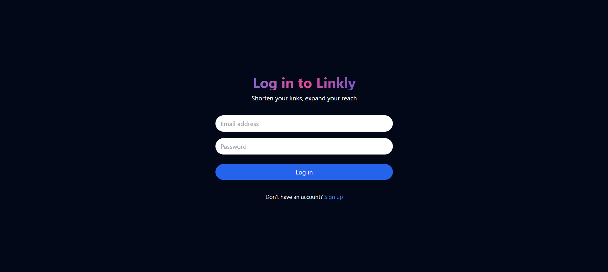
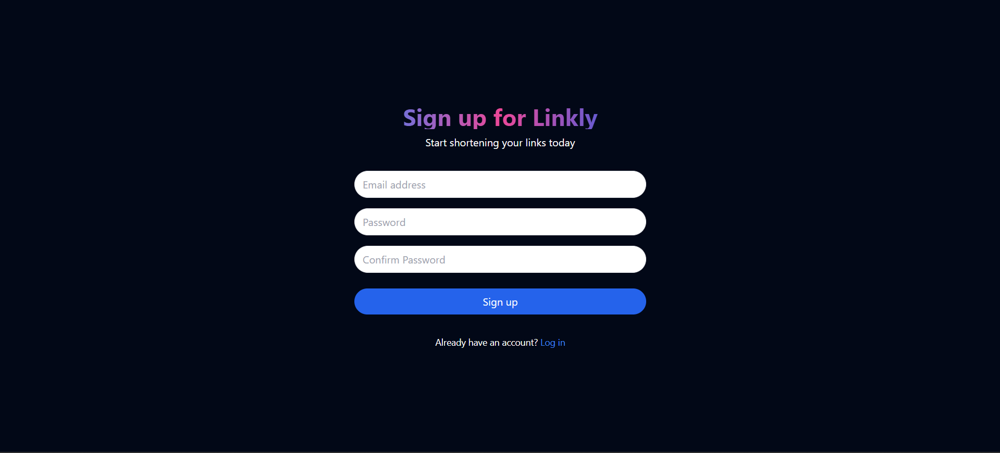
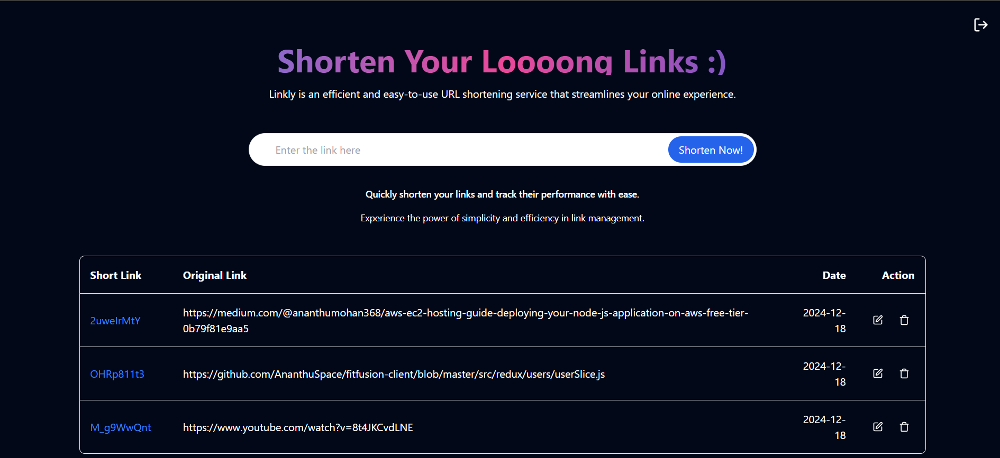

# URL Shortener System

The **URL Shortener System** is a robust application designed to efficiently shorten long URLs into compact links, allowing users to manage and share URLs more effectively.

## Key Features
- **URL Shortening:** Generate short, user-friendly URLs.
- **URL Management:** Edit and delete existing short URLs.
- **Analytics:** Track usage and statistics for shortened URLs.
- **Secure Backend:** Ensures safe handling of user data and links.
- **Interactive Frontend:** User-friendly design for seamless interaction.

---

## How It Works:
1. **Input URL:** Users input the long URL into the system.  
2. **Backend Processing:** The URL is processed and stored securely in the backend.  
3. **Short URL Generation:** A unique short link is generated and displayed.  
4. **URL Management:** Users can view, edit, and delete their short URLs.  

---

## Demo
[Live](https://urlshortener-rosy.vercel.app/)

---

## Screenshots







---

## Installation

### Clone the repository:
```bash
git clone https://github.com/AnanthuSpace/url-shortener
```

---

## Folder Structure and Explanations

### **Frontend:**
The frontend is built using **React** and **TypeScript** for a modular, scalable, and efficient UI. Here's the explanation of the key folders:  
- **src/components:** Contains reusable UI components like buttons, cards, and input fields.  
- **src/contexts:** Uses Context API to manage and share state across components.  
- **src/hooks:** Contains custom React hooks for reusable logic.  
- **src/interceptors:** Manages Axios interceptors for handling API requests and responses.  
- **src/pages:** Includes major pages such as the Home page, Dashboard, and Error pages.  
- **src/routes:** Defines application routes and their respective components.  
- **src/types:** Contains TypeScript type definitions for props, state, and API responses.  
- **App.tsx:** The main application component that sets up routes and contexts.  
- **index.css:** Global styles for the application.  
- **main.tsx:** Entry point for the React application.  

---

### **Backend:**
The backend is built using **Node.js** and **TypeScript**, following a modular architecture. Here's the explanation of the key folders:  
- **src/Config:** Contains configuration files for database connections and environment setup.  
- **src/Controllers:** Handles incoming requests, interacts with services, and returns responses.  
- **src/Enums:** Defines enumerations used throughout the application for consistency.  
- **src/Interfaces:** Contains TypeScript interfaces for defining data models and request/response structures.  
- **src/Modals:** Includes Mongoose models to interact with the MongoDB database.  
- **src/Repository:** Abstracts database operations like CRUD for improved modularity.  
- **src/Types:** Contains custom type definitions for backend operations.  
- **src/routes:** Defines API endpoint routes and links them to respective controllers.  
- **src/service:** Contains business logic to process data and implement features.  
- **app.ts:** The main entry point of the application, initializing the server and middleware.

---

## Run Locally

### Frontend Setup:
1. Navigate to the frontend directory:
   ```bash
   cd url-shortener/client
   ```
2. Install dependencies:
   ```bash
   npm install
   ```
3. Start the development server:
   ```bash
   npm start
   ```

### Backend Setup:
1. Navigate to the backend directory:
   ```bash
   cd ../server
   ```
2. Install dependencies:
   ```bash
   npm install
   ```
3. Configure environment variables:
   *(Create a `.env` file in the root of the server folder)*  
   - `PORT=5000`  
   - `DATABASE_URL=your_database_url`  
   - `JWT_SECRET=your_jwt_secret`  

4. Start the backend server:
   ```bash
   npm start
   ```

---

## Environment Variables

### Frontend:
Add the following variable to the `.env` file in the frontend directory:
```plaintext
VITE_API_URL=your_backend_url
```

### Backend:
Add these variables to the `.env` file in the backend directory:
```plaintext
PORT=5000
DATABASE_URL=your_database_url
JWT_SECRET=your_jwt_secret
```

---

## Technologies Used

### Frontend:
- **Framework:** React with TypeScript  
- **Styling:** TailwindCSS  
- **Bundler:** Vite  

### Backend:
- **Framework:** Node.js with TypeScript  
- **Database:** MongoDB  
- **Authentication:** JWT  
- **Email Service:** Nodemailer  

---

## Authors

- [@AnanthuSpace](https://github.com/AnanthuSpace)
